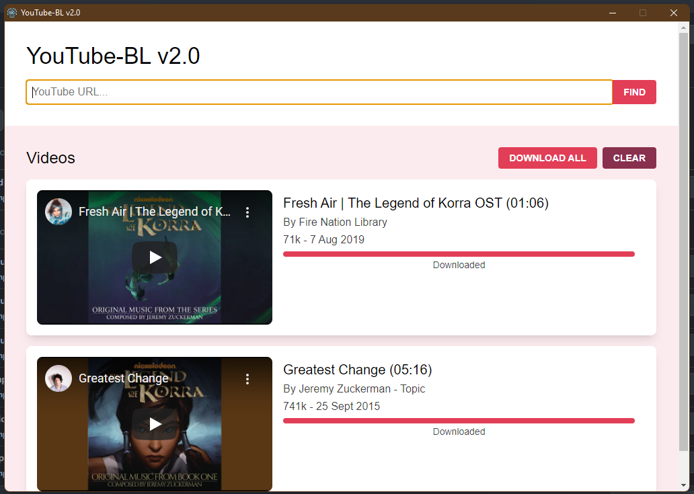

# ytbl-v2


## About this Project

Summary



Description

### Built with

- Electron
- React
- Sass
- ytdl-core
- Ffmpeg Installer
- Fluent ffmpeg-API

## Getting Started

### Prerequisites

- Node

### Installation

1. Install the dependencies.

```
npm i
```

2. Run the build tool.

```
npm run dev
```

## Deployment

...

## Usage

...

## Roadmap

- [ ] Animated toasts

## Release History

- v0.1.0
  - Initial design
